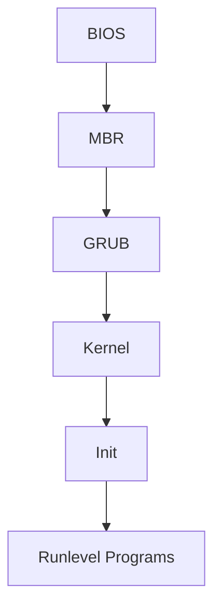

# Linux Boot Process (Startup Sequence)
*by Ramesh Natarajan on February 7, 2011*

Press the power button on your system, and after few moments you see the Linux login prompt. Have you ever wondered what happens behind the scenes from the time you press the power button until the Linux login prompt appears?

The following are the 6 high level stages of a typical Linux boot process.



## 1. BIOS (Basic Input/Output System)
- Performs system integrity checks
- Tasks:
  - Searches for boot loader
  - Loads and executes boot loader
  - Checks boot sequence (configurable via F12/F2)
- Hands control to MBR after completion

## 2. MBR (Master Boot Record)
- Located in first sector of bootable disk (`/dev/hda` or `/dev/sda`)
- Size: 512 bytes divided into:
  1. Primary boot loader (446 bytes)
  2. Partition table (64 bytes)
  3. MBR validation check (2 bytes)
- Contains GRUB information

## 3. GRUB (Grand Unified Bootloader)
- Allows selection of multiple kernel images
- Configuration: `/boot/grub/grub.conf`

Example configuration:
```bash
#boot=/dev/sda
default=0
timeout=5
splashimage=(hd0,0)/boot/grub/splash.xpm.gz
hiddenmenu
title CentOS (2.6.18-194.el5PAE)
    root (hd0,0)
    kernel /boot/vmlinuz-2.6.18-194.el5PAE ro root=LABEL=/
    initrd /boot/initrd-2.6.18-194.el5PAE.img
```

## 4. Kernel
- Mounts root filesystem
- Executes `/sbin/init` (PID 1)
- Uses initrd (Initial RAM Disk):
  - Temporary root filesystem
  - Contains essential drivers
  - Enables hardware access

## 5. Init
- Reads `/etc/inittab`
- Run Levels:
  - 0: Halt
  - 1: Single user mode
  - 2: Multiuser, without NFS
  - 3: Full multiuser mode
  - 4: Unused
  - 5: X11
  - 6: Reboot

## 6. Runlevel Programs
- Located in `/etc/rc.d/rcN.d/` (N = runlevel number)
- File naming convention:
  - S*: Startup programs
  - K*: Kill (shutdown) programs
- Number indicates sequence (e.g., S12syslog starts before S80sendmail)

### Directory Structure:
```
/etc/rc.d/
├── rc0.d/ (halt)
├── rc1.d/ (single user)
├── rc2.d/ (multiuser)
├── rc3.d/ (full multiuser)
├── rc4.d/ (unused)
├── rc5.d/ (X11)
└── rc6.d/ (reboot)
```

Note: Symbolic links exist under `/etc/` (e.g., `/etc/rc0.d` → `/etc/rc.d/rc0.d`)

## Detailed Stage Explanations

### Stage 1: BIOS Deep Dive
BIOS stands for Basic Input/Output System. It performs some system integrity checks and searches, loads, and executes the boot loader program. It looks for boot loader in floppy, cd-rom, or hard drive. You can press a key (typically F12 of F2, but it depends on your system) during the BIOS startup to change the boot sequence.

Once the boot loader program is detected and loaded into the memory, BIOS gives the control to it. So, in simple terms BIOS loads and executes the MBR boot loader.

### Stage 2: MBR In Detail
MBR stands for Master Boot Record. It is located in the 1st sector of the bootable disk. Typically /dev/hda, or /dev/sda. MBR is less than 512 bytes in size. This has three components:
1. Primary boot loader info in 1st 446 bytes
2. Partition table info in next 64 bytes
3. MBR validation check in last 2 bytes

It contains information about GRUB (or LILO in old systems). So, in simple terms MBR loads and executes the GRUB boot loader.

### Stage 3: GRUB Deep Dive
GRUB stands for Grand Unified Bootloader. If you have multiple kernel images installed on your system, you can choose which one to be executed. GRUB displays a splash screen, waits for few seconds, if you don't enter anything, it loads the default kernel image as specified in the grub configuration file.

GRUB has the knowledge of the filesystem (the older Linux loader LILO didn't understand filesystem). As you notice from the configuration info, it contains kernel and initrd image. So, in simple terms GRUB just loads and executes Kernel and initrd images.

### Stage 4: Kernel In Detail
Since init was the 1st program to be executed by Linux Kernel, it has the process id (PID) of 1. Do a 'ps -ef | grep init' and check the pid. initrd stands for Initial RAM Disk.

initrd is used by kernel as temporary root file system until kernel is booted and the real root file system is mounted. It also contains necessary drivers compiled inside, which helps it to access the hard drive partitions, and other hardware.

### Stage 5: Init Deep Dive
Init identifies the default initlevel from /etc/inittab and uses that to load all appropriate programs. Execute 'grep initdefault /etc/inittab' on your system to identify the default run level.

If you want to get into trouble, you can set the default run level to 0 or 6. Since you know what 0 and 6 means, probably you might not do that. Typically you would set the default run level to either 3 or 5.

### Stage 6: Runlevel Programs In Detail
When the Linux system is booting up, you might see various services getting started. For example, it might say "starting sendmail …. OK". Those are the runlevel programs, executed from the run level directory as defined by your run level.

Under the /etc/rc.d/rc*.d/ directories, you would see programs that start with S and K:
- Programs starts with S are used during startup. S for startup.
- Programs starts with K are used during shutdown. K for kill.
- Numbers right next to S and K indicate sequence (e.g., S12syslog starts before S80sendmail)
